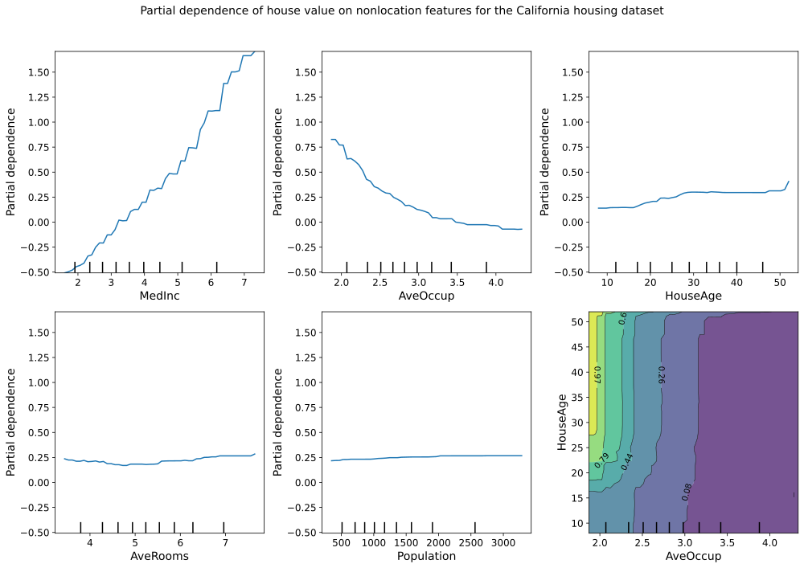
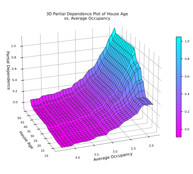

Partial Dependence Plots
=========================

**Partial Dependence Plots (PDPs)** are a powerful tool in machine learning 
interpretability, providing insights into how features influence the predicted 
outcome of a model. PDPs can be generated in both 2D and 3D, depending on 
whether you want to analyze the effect of one feature or the interaction between 
two features on the model's predictions.

.. _2D_Partial_Dependence_Plots:

2D Partial Dependence Plots
-----------------------------

The ``plot_2d_pdp`` function generates 2D partial dependence plots (PDPs) for specified features or pairs of features. These plots help analyze the marginal effect of individual or paired features on the predicted outcome.

**Key Features**:

- **Flexible Plot Layouts**: Generate all 2D PDPs in a grid layout, as separate individual plots, or both for maximum versatility.
- **Customization Options**: Adjust figure size, font sizes for labels and ticks, and wrap long titles to ensure clear and visually appealing plots.
- **Save Plots**: Save generated plots in PNG or SVG formats with options to save all plots, only individual plots, or just the grid plot.

.. function:: plot_2d_pdp(model, X_train, feature_names, features, title="Partial dependence plot", grid_resolution=50, plot_type="grid", grid_figsize=(12, 8), individual_figsize=(6, 4), label_fontsize=12, tick_fontsize=10, text_wrap=50, image_path_png=None, image_path_svg=None, save_plots=None, file_prefix="partial_dependence")

    Generate and save 2D partial dependence plots for specified features using a trained machine learning model. The function supports grid and individual layouts and provides options for customization and saving plots in various formats.

    :param model: The trained machine learning model used to generate partial dependence plots.
    :type model: estimator object

    :param X_train: The training data used to compute partial dependence. Should correspond to the features used to train the model.
    :type X_train: pandas.DataFrame or numpy.ndarray

    :param feature_names: A list of feature names corresponding to the columns in ``X_train``.
    :type feature_names: list of str

    :param features: A list of feature indices or tuples of feature indices for which to generate partial dependence plots.
    :type features: list of int or tuple of int

    :param title: The title for the entire plot. Default is ``"Partial dependence plot"``.
    :type title: str, optional

    :param grid_resolution: The resolution of the grid used to compute the partial dependence. Higher values provide smoother curves but may increase computation time. Default is ``50``.
    :type grid_resolution: int, optional

    :param plot_type: The type of plot to generate. Choose ``"grid"`` for a grid layout, ``"individual"`` for separate plots, or ``"both"`` to generate both layouts. Default is ``"grid"``.
    :type plot_type: str, optional

    :param grid_figsize: Tuple specifying the width and height of the figure for the grid layout. Default is ``(12, 8)``.
    :type grid_figsize: tuple, optional

    :param individual_figsize: Tuple specifying the width and height of the figure for individual plots. Default is ``(6, 4)``.
    :type individual_figsize: tuple, optional

    :param label_fontsize: Font size for the axis labels and titles. Default is ``12``.
    :type label_fontsize: int, optional

    :param tick_fontsize: Font size for the axis tick labels. Default is ``10``.
    :type tick_fontsize: int, optional

    :param text_wrap: The maximum width of the title text before wrapping. Useful for managing long titles. Default is ``50``.
    :type text_wrap: int, optional

    :param image_path_png: The directory path where PNG images of the plots will be saved, if saving is enabled.
    :type image_path_png: str, optional

    :param image_path_svg: The directory path where SVG images of the plots will be saved, if saving is enabled.
    :type image_path_svg: str, optional

    :param save_plots: Controls whether to save the plots. Options include ``"all"``, ``"individual"``, ``"grid"``, or ``None`` (default). If saving is enabled, ensure ``image_path_png`` or ``image_path_svg`` are provided.
    :type save_plots: str, optional

    :param file_prefix: Prefix for the filenames of the saved grid plots. Default is ``"partial_dependence"``.
    :type file_prefix: str, optional

    :raises ValueError:
        - If ``plot_type`` is not one of ``"grid"``, ``"individual"``, or ``"both"``.
        - If ``save_plots`` is enabled but neither ``image_path_png`` nor ``image_path_svg`` is provided.

    :returns: ``None``
        This function generates partial dependence plots and displays them. It does not return any values.

2D Plots - CA Housing Example
^^^^^^^^^^^^^^^^^^^^^^^^^^^^^^^

Consider a scenario where you have a machine learning model predicting median 
house values in California. [4]_ Suppose you want to understand how non-location 
features like the average number of occupants per household (``AveOccup``) and the 
age of the house (``HouseAge``) jointly influence house values. A 2D partial 
dependence plot allows you to visualize this relationship in two ways: either as 
individual plots for each feature or as a combined plot showing the interaction 
between two features.

For instance, the 2D partial dependence plot can help you analyze how the age of 
the house impacts house values while holding the number of occupants constant, or 
vice versa. This is particularly useful for identifying the most influential 
features and understanding how changes in these features might affect the 
predicted house value.

If you extend this to two interacting features, such as ``AveOccup`` and ``HouseAge``, 
you can explore their combined effect on house prices. The plot can reveal how 
different combinations of occupancy levels and house age influence the value, 
potentially uncovering non-linear relationships or interactions that might not be
immediately obvious from a simple 1D analysis.

Here’s how you can generate and visualize these 2D partial dependence plots using 
the California housing dataset:

**Fetch The CA Housing Dataset and Prepare The DataFrame**

.. code-block:: python

    from sklearn.datasets import fetch_california_housing
    from sklearn.model_selection import train_test_split
    from sklearn.ensemble import GradientBoostingRegressor
    import pandas as pd

    # Load the dataset
    data = fetch_california_housing()
    df = pd.DataFrame(data.data, columns=data.feature_names)

**Split The Data Into Training and Testing Sets**

.. code-block:: python

    X_train, X_test, y_train, y_test = train_test_split(
        df, data.target, test_size=0.2, random_state=42
    )

**Train a GradientBoostingRegressor Model**

.. code-block:: python

    model = GradientBoostingRegressor(
        n_estimators=100,
        max_depth=4,
        learning_rate=0.1,
        loss="huber",
        random_state=42,
    )
    model.fit(X_train, y_train)

**Create 2D Partial Dependence Plot Grid**

.. code-block:: python

    from eda_toolkit import plot_2d_pdp

    # Feature names
    names = data.feature_names

    # Generate 2D partial dependence plots
    plot_2d_pdp(
        model=model,
        X_train=X_train,
        feature_names=names,
        features=[
            "MedInc",
            "AveOccup",
            "HouseAge",
            "AveRooms",
            "Population",
            ("AveOccup", "HouseAge"),
        ],
        title="PDP of house value on CA non-location features",
        grid_figsize=(14, 10),
        individual_figsize=(12, 4),
        label_fontsize=14,
        tick_fontsize=12,
        text_wrap=120,
        plot_type="grid",
        image_path_png="path/to/save/png",  
        save_plots="all",
    )

.. raw:: html

   

.. raw:: html

   

.. raw:: html
   
   

.. _3D_Partial_Dependence_Plots:

3D Partial Dependence Plots
-----------------------------

The ``plot_3d_pdp`` function extends the concept of partial dependence to three dimensions, allowing you to visualize the interaction between two features and their combined effect on the model’s predictions.

- **Interactive and Static 3D Plots**: Generate static 3D plots using Matplotlib or interactive 3D plots using Plotly. The function also allows for generating both types simultaneously.
- **Colormap and Layout Customization**: Customize the colormaps for both Matplotlib and Plotly plots. Adjust figure size, camera angles, and zoom levels to create plots that fit perfectly within your presentation or report.
- **Axis and Title Configuration**: Customize axis labels for both Matplotlib and Plotly plots. Adjust font sizes and control the wrapping of long titles to maintain readability.

.. function:: plot_3d_pdp(model, dataframe, feature_names_list, x_label=None, y_label=None, z_label=None, title, html_file_path=None, html_file_name=None, image_filename=None, plot_type="both", matplotlib_colormap=None, plotly_colormap="Viridis", zoom_out_factor=None, wireframe_color=None, view_angle=(22, 70), figsize=(7, 4.5), text_wrap=50, horizontal=-1.25, depth=1.25, vertical=1.25, cbar_x=1.05, cbar_thickness=25, title_x=0.5, title_y=0.95, top_margin=100, image_path_png=None, image_path_svg=None, show_cbar=True, grid_resolution=20, left_margin=20, right_margin=65, label_fontsize=8, tick_fontsize=6, enable_zoom=True, show_modebar=True)

    Generate 3D partial dependence plots for two features of a machine learning model.

    This function supports both static (Matplotlib) and interactive (Plotly) visualizations, allowing for flexible and comprehensive analysis of the relationship between two features and the target variable in a model.

    :param model: The trained machine learning model used to generate partial dependence plots.
    :type model: estimator object

    :param dataframe: The dataset on which the model was trained or a representative sample. If a DataFrame is provided, ``feature_names_list`` should correspond to the column names. If a NumPy array is provided, ``feature_names_list`` should correspond to the indices of the columns.
    :type dataframe: pandas.DataFrame or numpy.ndarray

    :param feature_names_list: A list of two feature names or indices corresponding to the features for which partial dependence plots are generated.
    :type feature_names_list: list of str

    :param x_label: Label for the x-axis in the plots. Default is ``None``.
    :type x_label: str, optional

    :param y_label: Label for the y-axis in the plots. Default is ``None``.
    :type y_label: str, optional

    :param z_label: Label for the z-axis in the plots. Default is ``None``.
    :type z_label: str, optional

    :param title: The title for the plots.
    :type title: str

    :param html_file_path: Path to save the interactive Plotly HTML file. Required if ``plot_type`` is ``"interactive"`` or ``"both"``. Default is ``None``.
    :type html_file_path: str, optional

    :param html_file_name: Name of the HTML file to save the interactive Plotly plot. Required if ``plot_type`` is ``"interactive"`` or ``"both"``. Default is ``None``.
    :type html_file_name: str, optional

    :param image_filename: Base filename for saving static Matplotlib plots as PNG and/or SVG. Default is ``None``.
    :type image_filename: str, optional

    :param plot_type: The type of plots to generate. Options are:
                      - ``"static"``: Generate only static Matplotlib plots.
                      - ``"interactive"``: Generate only interactive Plotly plots.
                      - ``"both"``: Generate both static and interactive plots. Default is ``"both"``.
    :type plot_type: str, optional

    :param matplotlib_colormap: Custom colormap for the Matplotlib plot. If not provided, a default colormap is used.
    :type matplotlib_colormap: matplotlib.colors.Colormap, optional

    :param plotly_colormap: Colormap for the Plotly plot. Default is ``"Viridis"``.
    :type plotly_colormap: str, optional

    :param zoom_out_factor: Factor to adjust the zoom level of the Plotly plot. Default is ``None``.
    :type zoom_out_factor: float, optional

    :param wireframe_color: Color for the wireframe in the Matplotlib plot. If ``None``, no wireframe is plotted. Default is ``None``.
    :type wireframe_color: str, optional

    :param view_angle: Elevation and azimuthal angles for the Matplotlib plot view. Default is ``(22, 70)``.
    :type view_angle: tuple, optional

    :param figsize: Figure size for the Matplotlib plot. Default is ``(7, 4.5)``.
    :type figsize: tuple, optional

    :param text_wrap: Maximum width of the title text before wrapping. Useful for managing long titles. Default is ``50``.
    :type text_wrap: int, optional

    :param horizontal: Horizontal camera position for the Plotly plot. Default is ``-1.25``.
    :type horizontal: float, optional

    :param depth: Depth camera position for the Plotly plot. Default is ``1.25``.
    :type depth: float, optional

    :param vertical: Vertical camera position for the Plotly plot. Default is ``1.25``.
    :type vertical: float, optional

    :param cbar_x: Position of the color bar along the x-axis in the Plotly plot. Default is ``1.05``.
    :type cbar_x: float, optional

    :param cbar_thickness: Thickness of the color bar in the Plotly plot. Default is ``25``.
    :type cbar_thickness: int, optional

    :param title_x: Horizontal position of the title in the Plotly plot. Default is ``0.5``.
    :type title_x: float, optional

    :param title_y: Vertical position of the title in the Plotly plot. Default is ``0.95``.
    :type title_y: float, optional

    :param top_margin: Top margin for the Plotly plot layout. Default is ``100``.
    :type top_margin: int, optional

    :param image_path_png: Directory path to save the PNG file of the Matplotlib plot. Default is None.
    :type image_path_png: str, optional

    :param image_path_svg: Directory path to save the SVG file of the Matplotlib plot. Default is None.
    :type image_path_svg: str, optional

    :param show_cbar: Whether to display the color bar in the Matplotlib plot. Default is ``True``.
    :type show_cbar: bool, optional

    :param grid_resolution: The resolution of the grid for computing partial dependence. Default is ``20``.
    :type grid_resolution: int, optional

    :param left_margin: Left margin for the Plotly plot layout. Default is ``20``.
    :type left_margin: int, optional

    :param right_margin: Right margin for the Plotly plot layout. Default is ``65``.
    :type right_margin: int, optional

    :param label_fontsize: Font size for axis labels in the Matplotlib plot. Default is ``8``.
    :type label_fontsize: int, optional

    :param tick_fontsize: Font size for tick labels in the Matplotlib plot. Default is ``6``.
    :type tick_fontsize: int, optional

    :param enable_zoom: Whether to enable zooming in the Plotly plot. Default is ``True``.
    :type enable_zoom: bool, optional

    :param show_modebar: Whether to display the mode bar in the Plotly plot. Default is ``True``.
    :type show_modebar: bool, optional

    :raises ValueError: 
        - If ``plot_type`` is not one of ``"static"``, ``"interactive"``, or ``"both"``. 
        - If ``plot_type`` is ``"interactive"`` or ``"both"`` and ``html_file_path`` or ``html_file_name`` are not provided.

    :returns: ``None`` 
        This function generates 3D partial dependence plots and displays or saves them. It does not return any values.
    
    .. note::

        - This function handles warnings related to scikit-learn's ``partial_dependence`` function, specifically a ``FutureWarning`` related to non-tuple sequences for multidimensional indexing. This warning is suppressed as it stems from the internal workings of scikit-learn in Python versions like 3.7.4.
        - To maintain compatibility with different versions of scikit-learn, the function attempts to use ``"values"`` for grid extraction in newer versions and falls back to ``"grid_values"`` for older versions.

3D Plots - CA Housing Example
^^^^^^^^^^^^^^^^^^^^^^^^^^^^^^^^

Consider a scenario where you have a machine learning model predicting median 
house values in California.[4]_ Suppose you want to understand how non-location 
features like the average number of occupants per household (``AveOccup``) and the 
age of the house (``HouseAge``) jointly influence house values. A 3D partial 
dependence plot allows you to visualize this relationship in a more comprehensive 
manner, providing a detailed view of how these two features interact to affect 
the predicted house value.

For instance, the 3D partial dependence plot can help you explore how different 
combinations of house age and occupancy levels influence house values. By 
visualizing the interaction between AveOccup and HouseAge in a 3D space, you can 
uncover complex, non-linear relationships that might not be immediately apparent 
in 2D plots.

This type of plot is particularly useful when you need to understand the joint 
effect of two features on the target variable, as it provides a more intuitive 
and detailed view of how changes in both features impact predictions simultaneously.

Here’s how you can generate and visualize these 3D partial dependence plots 
using the California housing dataset:

Static Plot
^^^^^^^^^^^^^^^^^

**Fetch The CA Housing Dataset and Prepare The DataFrame**

.. code-block:: python

    from sklearn.ensemble import GradientBoostingRegressor
    from sklearn.datasets import fetch_california_housing
    from sklearn.model_selection import train_test_split
    import pandas as pd

    # Load the dataset
    data = fetch_california_housing()
    df = pd.DataFrame(data.data, columns=data.feature_names)

**Split The Data Into Training and Testing Sets**

.. code-block:: python

    X_train, X_test, y_train, y_test = train_test_split(
        df, data.target, test_size=0.2, random_state=42
    )

**Train a GradientBoostingRegressor Model**

.. code-block:: python

    model = GradientBoostingRegressor(
        n_estimators=100,
        max_depth=4,
        learning_rate=0.1,
        loss="huber",
        random_state=1,
    )
    model.fit(X_train, y_train)

**Create Static 3D Partial Dependence Plot**

.. code-block:: python

    from eda_toolkit import plot_3d_pdp

    plot_3d_pdp(
        model=model,
        dataframe=X_test,  
        feature_names_list=["HouseAge", "AveOccup"],
        x_label="House Age",
        y_label="Average Occupancy",
        z_label="Partial Dependence",
        title="3D Partial Dependence Plot of House Age vs. Average Occupancy",
        image_filename="3d_pdp",
        plot_type="static",
        figsize=[8, 5],
        text_wrap=40,
        wireframe_color="black",
        image_path_png=image_path_png,
        grid_resolution=30,
    )

.. raw:: html

   

.. raw:: html

   

.. raw:: html
   
   

Interactive Plot
^^^^^^^^^^^^^^^^^

.. code-block:: python

    from eda_toolkit import plot_3d_pdp

    plot_3d_pdp(
        model=model,
        dataframe=X_test, 
        feature_names_list=["HouseAge", "AveOccup"],
        x_label="House Age",
        y_label="Average Occupancy",
        z_label="Partial Dependence",
        title="3D Partial Dependence Plot of House Age vs. Average Occupancy",
        html_file_path=image_path_png,
        image_filename="3d_pdp",
        html_file_name="3d_pdp.html",
        plot_type="interactive",
        text_wrap=80,
        zoom_out_factor=1.2,
        image_path_png=image_path_png,
        image_path_svg=image_path_svg,
        grid_resolution=30,
        label_fontsize=8,
        tick_fontsize=6,
        title_x=0.38,
        top_margin=10,
        right_margin=50,
        left_margin=50,
        cbar_x=0.9,
        cbar_thickness=25,
        show_modebar=False,
        enable_zoom=True,
    )

.. warning::

   **Scrolling Notice:**

   While interacting with the interactive Plotly plot below, scrolling down the 
   page using the mouse wheel may be blocked when the mouse pointer is hovering 
   over the plot. To continue scrolling, either move the mouse pointer outside 
   the plot area or use the keyboard arrow keys to navigate down the page.

.. raw:: html

    <iframe src="3d_pdp.html" style="border:none; width:100%; height:650px; margin-left: 0; padding: 0; overflow: auto;" scrolling="no"></iframe>

    

This interactive plot was generated using Plotly, which allows for rich, 
interactive visualizations directly in the browser. The plot above is an example
of an interactive 3D Partial Dependence Plot. Here's how it differs from 
generating a static plot using Matplotlib.

**Key Differences**

**Plot Type**:

- The ``plot_type`` is set to ``"interactive"`` for the Plotly plot and ``"static"`` for the Matplotlib plot.

**Interactive-Specific Parameters**:

- **HTML File Path and Name**: The ``html_file_path`` and ``html_file_name`` parameters are required to save the interactive Plotly plot as an HTML file. These parameters are not needed for static plots.
  
- **Zoom and Positioning**: The interactive plot includes parameters like ``zoom_out_factor``, ``title_x``, ``cbar_x``, and ``cbar_thickness`` to control the zoom level, title position, and color bar position in the Plotly plot. These parameters do not affect the static plot.
  
- **Mode Bar and Zoom**: The ``show_modebar`` and ``enable_zoom`` parameters are specific to the interactive Plotly plot, allowing you to toggle the visibility of the mode bar and enable or disable zoom functionality.

**Static-Specific Parameters**:

- **Figure Size and Wireframe Color**: The static plot uses parameters like ``figsize`` to control the size of the Matplotlib plot and ``wireframe_color`` to define the color of the wireframe in the plot. These parameters are not applicable to the interactive Plotly plot.

By adjusting these parameters, you can customize the behavior and appearance of your 3D Partial Dependence Plots according to your needs, whether for static or interactive visualization.
